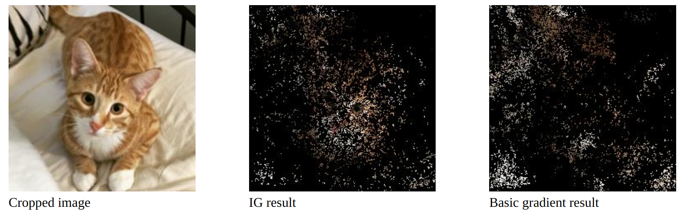

PytorchIntegratedGradients
===
Reimplementation of [Axiomatic attribution for deep networks](https://arxiv.org/abs/1703.01365) in PyTorch.

## Usage
Start the web server by running
<pre>
$ python main.py
</pre>

Then access it by localhost:8000.

## Citation
Please cite the original paper by
<pre>
@inproceedings{sundararajan2017axiomatic,
  title={Axiomatic attribution for deep networks},
  author={Sundararajan, Mukund and Taly, Ankur and Yan, Qiqi},
  booktitle={Proceedings of the 34th International Conference on Machine Learning-Volume 70},
  pages={3319--3328},
  year={2017},
  organization={JMLR.org}
}
</pre>

## Copyright
Mengxiao Lin <linmx0130@gmail.com> All rights reseved. See [LICENSE](./LICENSE) for more details.